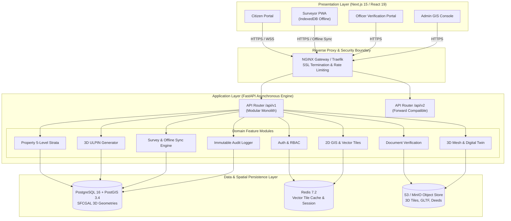
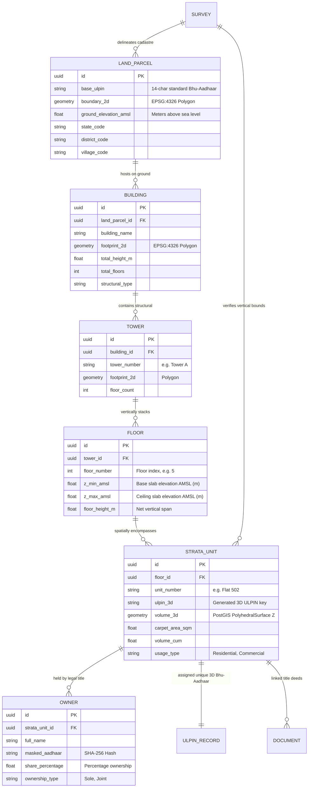

# GeoStrata – National 3D ULPIN & Vertical Property Mapping Platform

> **Smart India Hackathon (SIH)**
> **Problem Statement**: 3D ULPIN Generation and Vertical Property Mapping System
> **Standard**: Conforming to **ISO 19152 Land Administration Domain Model (LADM)** & Survey of India Geodetic Benchmark

---

## Executive Summary

**GeoStrata** is an enterprise-grade, nationwide 3D cadastral engine and vertical property mapping platform. While traditional land systems (Bhu-Aadhaar) operate strictly in 2D space—indexing only the ground footprint of a parcel—modern urbanization demands true three-dimensional cadastre to map, index, register, and tax high-rise apartments, commercial towers, multi-level infrastructure, and subterranean rights.

GeoStrata solves this challenge by introducing a **5-Level Strata Relational Hierarchy** and an **Extended 3D ULPIN Encoding Algorithm**, enabling seamless volumetric spatial queries, automated collision checks, tamper-evident audit trails, and offline field surveys.

---

## 1. Complete Project Folder Structure

```
c:/SIH2/
├── .github/
│   └── workflows/
│       ├── ci.yml                     # Frontend & Backend Lint, Typecheck, and Test Pipeline
│       └── docker-build.yml           # Container build validation pipeline
├── docker/
│   └── postgis/
│       └── init-extensions.sql        # PostGIS 3.4 + SFCGAL 3D extension initialization
├── frontend/                          # Next.js 15 (App Router), React 19, TypeScript, Tailwind
│   ├── .env.example
│   ├── Dockerfile                     # Multi-stage production container (standalone output)
│   ├── next.config.ts                 # Next.js config with security headers & standalone mode
│   ├── package.json                   # React 19, Three.js, R3F, Mapbox GL, Zustand, TanStack Query
│   ├── postcss.config.mjs
│   ├── tailwind.config.ts             # Government Design System palette & token mappings
│   ├── tsconfig.json                  # Strict TypeScript configuration
│   └── src/
│       ├── app/                       # Next.js App Router (Root layout & health only)
│       │   ├── api/health/route.ts
│       │   ├── error.tsx              # Error boundary
│       │   ├── layout.tsx             # Root Layout with Theme & Query providers
│       │   ├── not-found.tsx          # Accessible 404 handler
│       │   └── page.tsx               # Foundation homepage stub
│       ├── components/
│       │   ├── layout/                # Global Shell (Header, Footer)
│       │   ├── providers/             # ThemeProvider, QueryProvider
│       │   └── ui/                    # Reusable shadcn/ui primitives (Button, Card, Badge)
│       ├── features/                  # 18 Modular Bounded Contexts
│       │   ├── admin/                 # System nodes & admin configuration
│       │   ├── ai/                    # AI footprint extraction & deed OCR contracts
│       │   ├── analytics/             # FSI / FAR & volumetric density
│       │   ├── audit/                 # Immutable audit ledger
│       │   ├── auth/                  # JWT auth & RBAC
│       │   ├── citizen/               # Citizen title registry & search
│       │   ├── documents/             # Title deed registry & SHA-256 validation
│       │   ├── gis/                   # Mapbox GL & Turf.js layers
│       │   ├── notifications/         # Notification client & store
│       │   ├── officer/               # Officer approvals & validations
│       │   ├── offline-sync/          # IndexedDB queue & background sync
│       │   ├── property/              # 5-level strata hierarchy
│       │   ├── reports/               # Bhu-Aadhaar 3D PDF generation
│       │   ├── settings/              # CRS / projection preferences
│       │   ├── shared/                # Cross-cutting types & utilities
│       │   ├── survey/                # Field survey & GPS capture
│       │   ├── ulpin/                 # 3D ULPIN generation & verification
│       │   └── viewer-3d/             # Three.js / R3F volumetric viewer
│       ├── hooks/                     # Custom React hooks (useDebounce, useOnlineStatus)
│       ├── lib/                       # Singletons: apiClient, queryClient, mapbox, idb
│       ├── stores/                    # Zustand stores (theme, auth, gis, viewer3d, sync)
│       ├── styles/globals.css         # GovTech CSS variables & dark/light palette
│       └── types/                     # Shared TypeScript declarations
│
├── backend/                           # FastAPI, SQLAlchemy 2.0 Async, PostGIS 3.4, Redis
│   ├── .env.example
│   ├── Dockerfile                     # Multi-stage Python 3.12 with GDAL/GEOS C-libraries
│   ├── alembic.ini                    # Database migration configuration
│   ├── alembic/
│   │   ├── env.py                     # Async migration runner with GeoAlchemy2
│   │   └── script.py.mako
│   ├── pyproject.toml                 # Modern Python packaging configuration
│   ├── requirements.txt               # Pinned backend dependencies
│   └── app/
│       ├── main.py                    # Application factory, lifespan, CORS, and middleware
│       ├── api/
│       │   ├── deps.py                # Dependency injection (get_db, get_current_user, require_role)
│       │   ├── v1/
│       │   │   ├── router.py          # API v1 Router Aggregator
│       │   │   └── endpoints/         # 18 Versioned REST Endpoints
│       │   │       ├── admin.py
│       │   │       ├── ai.py
│       │   │       ├── analytics.py
│       │   │       ├── audit.py
│       │   │       ├── auth.py
│       │   │       ├── citizen.py
│       │   │       ├── documents.py
│       │   │       ├── gis.py
│       │   │       ├── notifications.py
│       │   │       ├── officer.py
│       │   │       ├── property.py
│       │   │       ├── reports.py
│       │   │       ├── settings.py
│       │   │       ├── shared.py
│       │   │       ├── survey.py
│       │   │       ├── sync.py
│       │   │       ├── ulpin.py
│       │   │       └── viewer_3d.py
│       │   └── v2/
│       │       └── router.py          # API v2 Forward-Compatible Gateway
│       ├── core/
│       │   ├── config.py              # Pydantic-settings BaseSettings
│       │   ├── database.py            # Async engine & sessionmaker
│       │   ├── exceptions.py          # Domain exceptions & RFC 7807 problem details
│       │   ├── middleware.py          # Audit correlation ID & timing middleware
│       │   ├── redis.py               # Async Redis connection pool
│       │   └── security.py            # JWT token creation & Bcrypt hashing
│       ├── models/                    # PostGIS 3D SQLAlchemy Declarative Models
│       │   ├── base.py                # DeclarativeBase, UUIDPrimaryKeyMixin, TimestampMixin
│       │   ├── land_parcel.py         # Ground parcel (Polygon, EPSG:4326)
│       │   ├── building.py            # Building footprint
│       │   ├── tower.py               # Tower / Wing
│       │   ├── floor.py               # Vertical Floor Slab (Z_min, Z_max AMSL)
│       │   ├── unit.py                # 3D Strata Unit (PolyhedralSurface Z)
│       │   ├── owner.py               # Title registry & SHA-256 identity hash
│       │   ├── survey.py              # Survey order, GPS accuracy, telemetry
│       │   ├── ulpin.py               # 3D ULPIN Record & QR code payload
│       │   ├── audit.py               # Immutable append-only audit ledger
│       │   ├── notification.py        # Multi-channel notification queue
│       │   ├── document.py            # Deed records with SHA-256 checksums
│       │   ├── ai_result.py           # ML footprint extraction results
│       │   └── analytics.py           # Volumetric density & FSI metrics
│       ├── schemas/                   # Pydantic v2 DTOs (Request / Response)
│       │   ├── analytics.py
│       │   ├── audit.py
│       │   ├── auth.py
│       │   ├── common.py
│       │   ├── document.py
│       │   ├── property.py
│       │   ├── survey.py
│       │   └── ulpin.py
│       └── services/                  # Clean Architecture Business Logic Layer
│           └── base.py
│
├── .env.example                       # Root environment variables
├── .gitignore                         # Comprehensive Git exclusion rules
├── docker-compose.yml                 # Multi-container orchestration (App, DB, Cache)
└── README.md                          # Master Enterprise Documentation
```

---

## 2. Architecture Diagrams

### 2.1 End-to-End System Topology



### 2.2 3D Strata Relational Hierarchy (ISO 19152 LADM)



---

## 3. Folder Responsibilities

| Sub-system | Path | Core Responsibility |
| :--- | :--- | :--- |
| **Root** | `/docker-compose.yml` | Multi-container orchestration (FastAPI, Next.js, PostGIS 3.4, Redis). |
| **Root** | `/.github/workflows` | Automated CI checks: linting, TypeScript verification, Python compilation, and Docker builds. |
| **Backend** | `backend/app/core` | Application infrastructure: configuration, async database engine, Redis pool, security, and correlation middleware. |
| **Backend** | `backend/app/models` | PostGIS 3D SQLAlchemy declarative models conforming to ISO 19152 LADM. |
| **Backend** | `backend/app/schemas` | Pydantic v2 data transfer objects (DTOs) with strict input validation. |
| **Backend** | `backend/app/api/v1` | Version 1 REST API routers for all 18 enterprise domain modules. |
| **Backend** | `backend/app/api/v2` | Forward-compatible API router prepared for future microservice extraction. |
| **Frontend**| `frontend/src/app` | Next.js 15 App Router root layouts, error boundaries, and health endpoints. |
| **Frontend**| `frontend/src/features`| 18 modular feature packages encapsulating types, stores, and service clients. |
| **Frontend**| `frontend/src/lib` | Singleton clients: Axios `apiClient`, TanStack `queryClient`, Mapbox, and IndexedDB `idb`. |
| **Frontend**| `frontend/src/stores` | Zustand stores for high-frequency client state (Theme, Auth, GIS Viewport, 3D Viewer, Sync). |

---

## 4. Dependencies Specification

### Frontend (`frontend/package.json`)
- **Next.js 15.1.0** & **React 19.0.0**: Server Components, Suspense streaming, high performance.
- **Tailwind CSS 3.4** & **tailwindcss-animate**: Utility styling with Government Design Tokens.
- **shadcn/ui primitives**: Radix-based accessible UI foundations (`clsx`, `tailwind-merge`, `cva`).
- **@tanstack/react-query v5**: Asynchronous server state caching, pagination, and invalidation.
- **Zustand v5**: Minimalist, unopinionated client state management.
- **Three.js & @react-three/fiber**: 3D WebGL rendering, volumetric strata cutaways, and raycasting.
- **Mapbox GL JS & @turf/turf**: 2D geospatial mapping, vector tiles, and spatial calculations.
- **React Hook Form & Zod**: High-performance form state with schema validation.
- **idb**: Lightweight Promise-based wrapper around IndexedDB for offline mutation storage.

### Backend (`backend/pyproject.toml` / `requirements.txt`)
- **FastAPI 0.115**: High-throughput asynchronous ASGI framework with automated OpenAPI schemas.
- **SQLAlchemy 2.0 (Async)** & **asyncpg**: Non-blocking async database transactions.
- **GeoAlchemy2 & Shapely**: Native integration with PostGIS 2D and 3D geometry types.
- **Alembic**: Database migration version control supporting PostGIS spatial columns.
- **Redis 5.2 (Async)**: In-memory cache and vector tile spatial buffering.
- **PyJWT & Passlib (Bcrypt)**: Cryptographic token issuance and secure password hashing.
- **Celery 5.4**: Distributed background task queue for heavy spatial and document workflows.

---

## 5. Docker Setup & Deployment

### One-Command Deployment

```bash
# 1. Clone the repository
git clone https://github.com/organization/geostrata.git
cd geostrata

# 2. Copy root environment template
cp .env.example .env

# 3. Launch the full enterprise stack with Docker Compose
docker compose up --build -d
```

### Stack Verification

Once launched, all services are operational:
- **Frontend Portal**: `http://localhost:3000`
- **Backend API**: `http://localhost:8000`
- **Interactive Swagger Docs**: `http://localhost:8000/docs`
- **ReDoc API Reference**: `http://localhost:8000/redoc`
- **PostGIS 3D Database**: `localhost:5432` (`geostrata_db`)
- **Redis In-Memory Cache**: `localhost:6379`

---

## 6. Environment Variables

### Root (`.env.example`)
```env
ENVIRONMENT=development
COMPOSE_PROJECT_NAME=geostrata

POSTGRES_DB=geostrata_db
POSTGRES_USER=geostrata_admin
POSTGRES_PASSWORD=GeoStrataSecurePassword2026!
POSTGRES_PORT=5432

REDIS_PASSWORD=RedisGeoStrataSecureKey2026!
REDIS_PORT=6379

BACKEND_PORT=8000
FRONTEND_PORT=3000

SECRET_KEY=geostrata-enterprise-insecure-secret-key-change-in-production-min-32-chars
ALGORITHM=HS256
ACCESS_TOKEN_EXPIRE_MINUTES=60

NEXT_PUBLIC_MAPBOX_ACCESS_TOKEN=pk.mock_token_for_development_placeholder
NEXT_PUBLIC_API_URL=http://localhost:8000/api/v1
```

---

## 7. API Versioning Structure

GeoStrata enforces URL path versioning to guarantee backward compatibility:

- **Version 1 (`/api/v1`)**: Primary modular monolith API covering all 18 core domain modules.
- **Version 2 (`/api/v2`)**: Forward-compatible gateway designed for future microservice extraction and federated queries.

### Module Routers in `/api/v1`:
- `/api/v1/auth`: Authentication and role tokens.
- `/api/v1/properties`: 5-level strata hierarchy (Parcels, Buildings, Towers, Floors, Units).
- `/api/v1/ulpin`: 3D ULPIN generation algorithm and public verification.
- `/api/v1/gis`: 2D cadastral layers and Mapbox Vector Tile (MVT) streaming.
- `/api/v1/viewer-3d`: 3D mesh buffer geometry streaming and floor cutaways.
- `/api/v1/survey`: Field surveyor submissions and GPS telemetry.
- `/api/v1/sync`: Offline IndexedDB mutation queue batch processing.
- `/api/v1/citizen`: Citizen title search and application tracking.
- `/api/v1/officer`: Official validations and approval workflows.
- `/api/v1/admin`: Administrative telemetry and user access management.
- `/api/v1/documents`: Title deeds, cadastral maps, and SHA-256 integrity verification.
- `/api/v1/audit`: Append-only tamper-evident audit ledger.
- `/api/v1/notifications`: Multi-channel alerts (In-app, SMS, Email, Push).
- `/api/v1/analytics`: FSI / FAR compliance and volumetric density metrics.
- `/api/v1/reports`: Official Bhu-Aadhaar 3D PDF certificates.
- `/api/v1/settings`: Spatial Reference System (CRS) configurations.
- `/api/v1/ai`: AI footprint matching and deed OCR inference contracts.
- `/api/v1/health`: System heartbeat and container readiness probe.

---

## 8. State Management Strategy

GeoStrata enforces a clean **4-Tier State Separation**:

1. **Server State (TanStack Query v5)**:
   - Manages asynchronous remote queries, automated background revalidation, cache garbage collection, and mutation rollbacks.
2. **Global Client State (Zustand v5)**:
   - Stores fast, transient UI state: theme (Dark/Light), active GIS layers, selected 3D building/floor cutaway height, and active user session.
3. **Form State (React Hook Form + Zod)**:
   - Manages high-speed local form state and schema-based validation for cadastral and survey data inputs without unnecessary re-renders.
4. **Offline Persistent State (IndexedDB via `idb`)**:
   - Stores surveyor drafts and a persistent mutation queue on mobile/PWA clients, syncing automatically with `/api/v1/sync/batch` upon reconnection.

---

## 9. Database Module Structure (PostGIS 3D)

All models inherit from `Base` with a UUID Primary Key (`uuid_generate_v4()`) and `TimestampMixin` (`created_at`, `updated_at`):

```
LandParcel (2D Polygon, EPSG:4326)
    ├── Building (Footprint, Structural specs)
    │     └── Tower (Tower identifier, Footprint)
    │           └── Floor (Z_min, Z_max AMSL elevation slab)
    │                 └── StrataUnit (3D PolyhedralSurface Z, Net Volume)
    │                       ├── Owner (Title Registry, SHA-256 Identity Hash)
    │                       ├── ULPINRecord (3D Bhu-Aadhaar key, QR Payload)
    │                       └── Document (Deeds, SHA-256 Checksum)
    └── Survey (GPS trajectory, Accuracy meters, Telemetry)

Cross-Cutting Tables:
    ├── AuditLog (Append-only immutable ledger, HMAC tamper hash)
    ├── Notification (Multi-channel queue)
    ├── AIResult (Footprint matching and deed OCR outputs)
    └── AnalyticsSnapshot (Volumetric FSI / FAR aggregates)
```

---

## 10. Government Design Language

The UI design adheres to the official GovTech palette:

| Token | Hex Value | Semantic Usage |
| :--- | :--- | :--- |
| **Primary** | `#2563EB` | National Digital Infrastructure Blue — primary buttons, active tabs, brand header. |
| **Secondary** | `#0F172A` | Slate Executive Dark — navigation surfaces, typography, dark mode backgrounds. |
| **Accent** | `#06B6D4` | High-Precision Cyan — 3D strata highlights, active GIS selections, raycast markers. |
| **Success** | `#22C55E` | Cadastral Green — verified title status, clean survey approval, online connectivity. |
| **Warning** | `#F59E0B` | Review Amber — pending verification, surveyor draft, temporary dispute. |
| **Danger** | `#EF4444` | Discrepancy Red — spatial 3D collision, overlapping boundary, invalid deed hash. |

- **Accessibility**: All color contrasts conform to **WCAG 2.1 AA** standards with visible focus rings (`:focus-visible`).
- **Theming**: Seamless transitions between Light Theme (administrative portals) and Dark Theme (command centers & 3D WebGL viewers).

---

## 11. Coding Standards

### TypeScript / Next.js
- **Strict Typing**: Zero `any` policy. All API responses are bounded by TypeScript interfaces.
- **Server Components by Default**: All layout and presentation pages are rendered as Server Components. Leaf interactive components use `'use client'` explicitly.
- **No Ad-hoc Styling**: All styles utilize predefined Tailwind semantic tokens (`bg-gov-primary`, `text-foreground`).

### Python / FastAPI
- **Mandatory Typing**: 100% type-annotated function signatures validated with Pydantic v2.
- **Asynchronous Database I/O**: Strict usage of `async with` and non-blocking `select()` statements via `AsyncSession`.
- **RFC 7807 Problem Details**: Standardized error payloads across all endpoints.

---

## 12. Naming Conventions

- **Directories**: `kebab-case` (`features/viewer-3d/`, `api/v1/endpoints/`).
- **TypeScript Files & Components**: `kebab-case.tsx` (`button.tsx`, `theme-provider.tsx`).
- **Python Modules**: `snake_case.py` (`land_parcel.py`, `ulpin_service.py`).
- **Python Classes**: `PascalCase` (`LandParcel`, `StrataUnit`, `Settings`).
- **Database Tables**: Plural `snake_case` (`land_parcels`, `strata_units`, `audit_logs`).
- **Database Columns**: `snake_case` (`base_ulpin`, `z_min_amsl`, `carpet_area_sqm`).
- **REST Endpoints**: Plural `kebab-case` (`/api/v1/strata-units`, `/api/v1/land-parcels`).
- **Constants & Enums**: `UPPER_SNAKE_CASE` (`DEFAULT_MAP_ZOOM`, `MAX_OVERFLOW`).

---

## 13. Architectural Decision Rationale

1. **Why Next.js 15 & React 19?**
   - Government land portals require fast initial page loads (FCP) and public search indexing on varying network speeds. Next.js Server Components drastically reduce client-side bundle size, delivering optimal performance across mobile and desktop devices.
2. **Why FastAPI + SQLAlchemy 2.0 Async + PostGIS?**
   - FastAPI is the fastest ASGI framework in Python, offering automatic OpenAPI generation and async request handling. PostGIS is the global standard for spatial analysis, and its 3D SFCGAL extension provides native support for volumetric solids (`ST_Volume`, `ST_3DIntersects`), which is critical for 3D cadastre.
3. **Why Modular Monolith transitioning to Microservices?**
   - Premature microservices introduce network latency, distributed transaction overhead, and deployment friction. GeoStrata's architecture enforces strict domain isolation within a modular monolith, allowing zero-downtime microservice extraction in future phases via the `/api/v2` gateway.
4. **Why Dual Map Engines (Mapbox GL + Three.js)?**
   - Mapbox GL is built for geographic terrain, tile layers, and high-speed 2D polygon rendering across regions. Three.js / React Three Fiber excels at rendering detailed 3D interior architecture, floor cutaways, and interactive unit raycasting. Using both provides the ideal dual-viewport spatial experience.
5. **Why Offline Sync Architecture?**
   - Field surveyors in tier-2/3 cities and rural zones often operate with intermittent internet connectivity. The persistent IndexedDB mutation queue ensures data is captured reliably offline and synchronized seamlessly once connectivity is restored.
